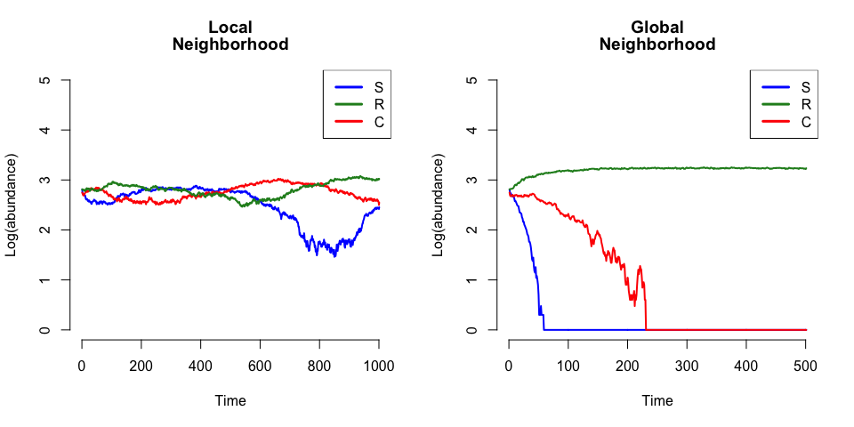
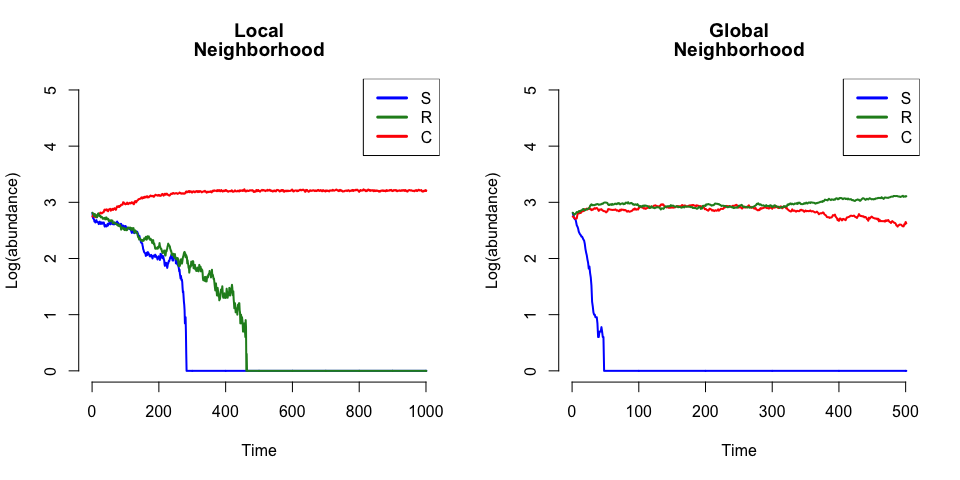

# The Maintenance of Biodiversity in a Dispersal-Limited Strains of E. coli
Edna Chiang and Marian Schmidt  
November 24, 2014  


##The Problem
1. How do **local** dispersal and species interactions influence biodiversity? 
2. How do **global** dispersal and species interactions influence biodiversity?


##Our Assumptions
* Simple community that perfectly follows Rock-Paper-Scissors model:
      + Resistant *E.coli* (R) beats colicin-producing *E.coli* (C)
      + Sensitive *E.coli* (S) beats R 
      + C beats S 
* No top-down or bottom up controls on community.
      + No outside disturbance.
      + No spatial or temporal environmental heterogeneity.
* Assume 2 extremes:
      + Local includes only adjacent cells.  Location is everything.
      + Global includes entire community.  All interactions created equally, location doesn't matter.
* Assumes background death rates are constant for each strain.
* Assumes no evolution of each strain (e.g. no evolution of S to R).


##Reproduction of Figure 1a-d

```
## Warning: package 'animation' was built under R version 3.1.1
```

 


##Experiment with R Death Rate 
As you can see above, the R wins the global scenario.  This is because R has a slighly lower death rate of 10/32 than the colicin-producing C, which has a death rate of 1/3.  We were wondering what would happen if we set the death rate of R to equal the death rate of C.

**Research questions:**  
1.  If R and C have the same death rate, do R, C, & S coexist in the **local** simulations?  
2.  If R and C have the same death rate, do R, C & S coexist in the **global** simulations?  

**Hypotheses:**   
1.  If R & C have the same death rate in **local** simulations, R, C, and S will coexist.  
2.  If R & C have the same death rate in **global** simulations, R and C will coexist and cause S to go extinct.   


 


#Discussion of Our Experiment
1. Our **local** hypothesis is incorrect. In the local simulation, S and R become extinct while C persists. In the original simulation, R helped S by keeping C's abundance low enough to allow for stable coexistence of S, R, and C. In this experiment, R's abundance is initially brought down by S because S beats R. Once S becomes extinct, R's abundance continues to decrease due to local interactions. Both R and C have an equal chance of death. However, because C is much more abundant than R, is it likely that empty niches are in contact with more C than R. As a result, C has more disperal than R, and eventually drives R to extinction.

2. Our **global** hypothesis is correct. In the global simulation, R and C have stable coexistence.  We think this is because in the original simulation, R beats C and therefore, causes complete extinction of C.  Since we have set the death rate of R and C to be equal, consequently, we have also set the survival rate of R and C to be equal.  As a result, R and C coexist.  S, on the other hand, still goes extinct because C is highly abundant. 


## GIF
We could not find a way to embed our GIFs in knitr or to create it without outside programs (e.g. ImageMagick).  Instead, we embedded it into an [interactive html webpage](https://cdn.rawgit.com/chianged/assignment05/master/GIF_related_files/GIFwebpage.html).


