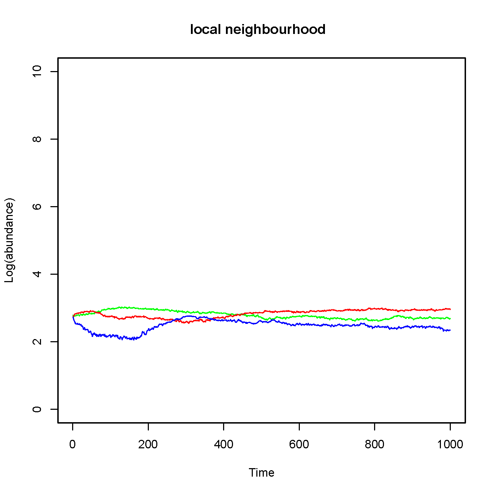
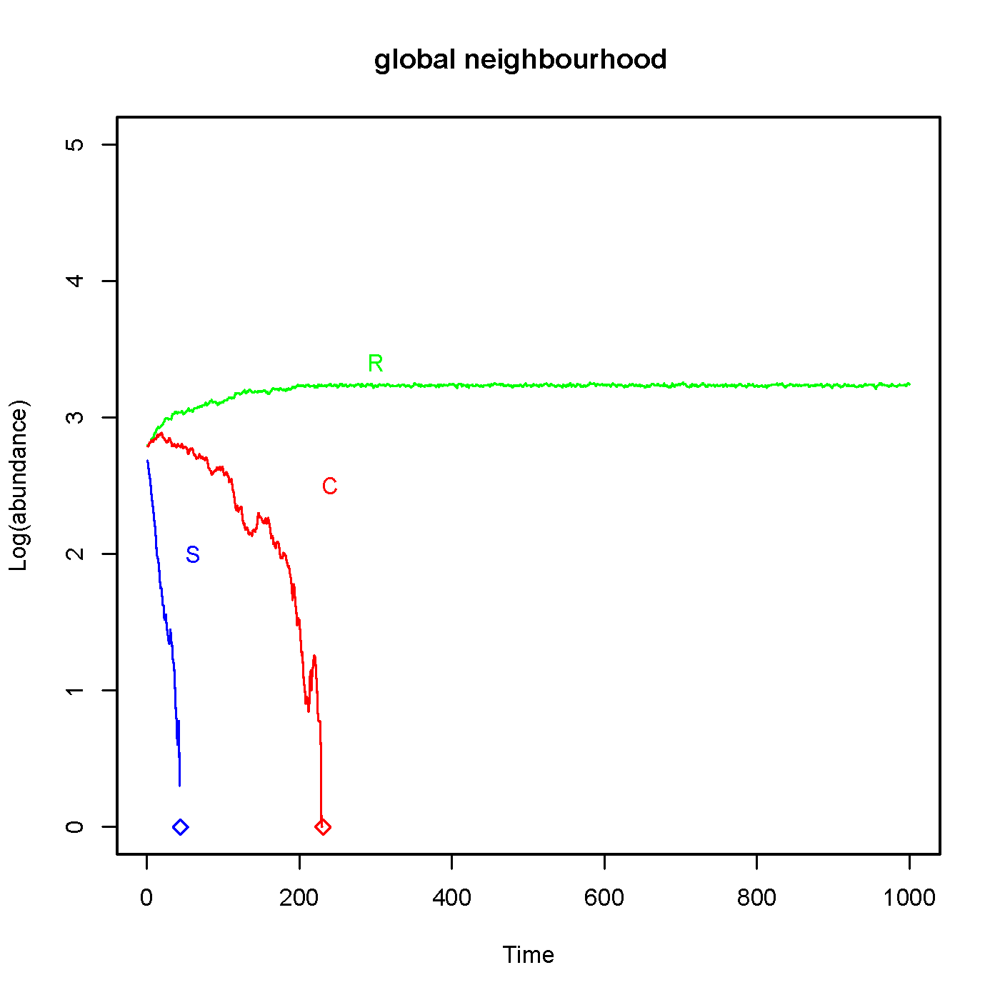
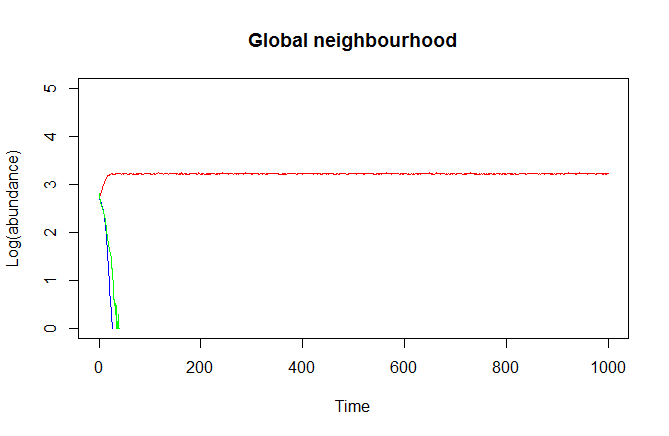
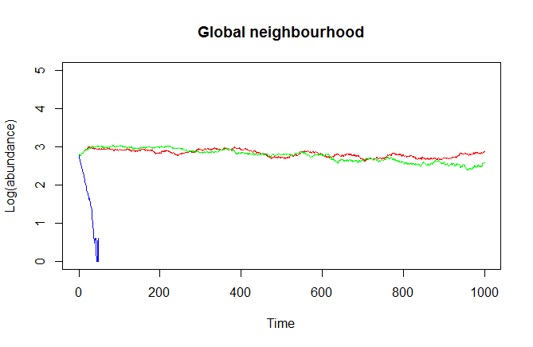

*** 

### Problem
The paper discusses a system involving a community of three competing species: colicinogenic E.coli (C), colicin-sensitive bacteria (S) and colicin-resistant bacteria (R). This C-S-R community satisfies a relationship similar to rock-paper-scissors game: S can displace R, R can displace C and C can displace S. The main question the paper is discussing is: How would this relationship affect the biodiversity in a small spatial scale and in a large spatial scale ecological processes. A code is written to simulate both ecological processes and the results of this code are discussed in this report.

### Assumptions
Several assumptions are made in order to write the code:

 * a 50*50 lattice represents the community with periodic boundaries, 
 * R, C, S and E (empty state) are randomly assigned to the lattice points,
 * the neighbourhood for the small spatial scale ecological processes corresponds to the eight lattice points around the specific focal point, 
 * the neighbourhood for the large spatial scale ecological processes corresponds to all lattice points around the specific focal point, and
 * updating a focal point depends on its current state and its neighbourhood state. Rules are the same for both small scale and large scale ecological processes and are shown in the following table. 
  

State before update | State after update | Probability
----------- | ------------ | ----------- 
E | S | f_S
E | R | f_R
E | C | f_C
E | E | f_E
S | E | delta_S
S | S | 1-delta_S
R | E | delta_R
R | R | 1-delta_R
C | E | delta_C
C | C | 1-delta_C

In the table, f_S, f_R, f_C, and f_E are the fractions of S, R, C and E in the neighbourhood of the focal point. Delta_S, delta_R, and delta_C are the probability that the S, R, and C cells are killed. The former is depended on the toxicity (represented by tau) of the colicin producing strain, i.e., delta_S = delta_S0 + tau*f_C. Delta_S0 is the probability that S dies without being influenced by C, and this value is assumed to be 1/4. The latter two are constant and are assumed to be 10/32 and 1/3, respectively. 


### Reproduction of line graphs and heatmap






```{r, echo=FALSE}
rm(list=ls())
#Creation of grid
create_grid <- function(size){
  types <- c("E", "R", "C", "S")
  data <- sample(types, size*size, replace = T)
  grid <- matrix(data, size, size)

return(grid)
}

#Setting up local neighbourhood and calculating fractions
find_local <- function (focalpoint_row, focalpoint_column, grid, size){  
    
#When the focal point is found somehwere in the middle,
if(focalpoint_row != 1 && focalpoint_row != size){
    local <- grid[(focalpoint_row-1):(focalpoint_row+1),]
    if (focalpoint_column != 1 && focalpoint_column != size){
      local <- local[, (focalpoint_column-1):(focalpoint_column+1)]
      local[2, 2] <- NA
      divider <- 8}      
    else if (focalpoint_column == size){
      local <- local[, (focalpoint_column-1):(focalpoint_column)]
      local[2, 2] <- NA
      divider <- 5}
    else{
      local <- local[, (focalpoint_column):(focalpoint_column+1)]
      local[2, 1] <- NA
      divider <- 5}
}

# When the focal point is found on the first row, 
else if (focalpoint_row == 1){
    local <- grid[(focalpoint_row):(focalpoint_row+1),]
    if (focalpoint_column != 1 && focalpoint_column != size){
      local <- local[, (focalpoint_column-1):(focalpoint_column+1)]
      local[1, 2] <- NA
      divider <- 5}   
    else if (focalpoint_column == size){
      local <- local[, (focalpoint_column-1):(focalpoint_column)]
      local[1, 2] <- NA
      divider <- 3}
    else{
      local <- local[, (focalpoint_column):(focalpoint_column+1)]
      local[1, 1] <- NA
      divider <- 3}}

#When the focal point is found on the last row, 
else{
    local <- grid[(focalpoint_row-1):(focalpoint_row),]
    if (focalpoint_column != 1 && focalpoint_column != size){
      local <- local[, (focalpoint_column-1):(focalpoint_column+1)]
      local[2, 2] <- NA
      divider <- 5}
    else if (focalpoint_column == size){
      local <- local[, (focalpoint_column-1):(focalpoint_column)]
      local[2, 2] <- NA
      divider <- 3}
    else{
      local <- local[, (focalpoint_column):(focalpoint_column+1)]
      local[2, 1] <- NA
      divider <- 3}}

#Calculate fraction and abundance 
  f_r <- length(grep("R", local))/divider
  f_c <- length(grep("C", local))/divider
  f_s <- length(grep("S", local))/divider
  f_e <- 1-f_r-f_c-f_s
  R_ab <- length(grep("R", grid))
  C_ab <- length(grep("C", grid))
  S_ab <- length(grep("S", grid))
  
  info <- list(f_e, f_r, f_c, f_s, R_ab, C_ab, S_ab)
  return(info)
}


find_global <- function (focalpoint_row, focalpoint_column, grid, size){
  grid[focalpoint_row, focalpoint_column] <- NA
  f_r <- length(grep("R", grid))/(size*size-1)
  f_c <- length(grep("C", grid))/(size*size-1)
  f_s <- length(grep("S", grid))/(size*size-1)
  f_e <- 1-f_r-f_c-f_s
  R_ab <- length(grep("R", grid))
  C_ab <- length(grep("C", grid))
  S_ab <- length(grep("S", grid))
  
  info <- list(f_e, f_r, f_c, f_s, R_ab, C_ab, S_ab)
  return(info)
}


#Setting up parameters.
delta_r <- 10/32
delta_c <- 1/3
delta_s0 <-1/4
tau <- 3/4


replace_focal <- function(focalpoint, neighbourhood_info){
  if (focalpoint == "E"){
    #Update empty space based on the occurence of the different types in the neighbourhood.
    focalpoint <- sample(c("E", "R", "C", "S"), 1, replace = T, prob = c(neighbourhood_info[[1]], neighbourhood_info[[2]], neighbourhood_info[[3]], neighbourhood_info[[4]]))}
  #Kill microorganism, with a probability equal to the given delta's. 
  else if (focalpoint == "R"){
    focalpoint <- sample(c("E", "R"), 1, replace = T, prob = c(delta_r, (1-delta_r)))}
  else if (focalpoint == "C"){
    focalpoint <- sample(c("E", "C"), 1, replace = T, prob = c(delta_c, (1-delta_c)))}
  else {
    delta_s <- delta_s0 + tau*neighbourhood_info[[3]]
    focalpoint <- sample(c("E", "S"), 1, replace = T, prob = c(delta_s, (1-delta_s)))}
    
    return(focalpoint)
}


#Updating the grid. This happens randomly and 2500 updates are called an 'epoch'.
#Inputs: the type of interaction (either "local" or "global"), the grid you want to update,the size of this grid, and the amount of updates you want to occur
update_grid <- function(interaction, grid, size, updates){

  #Initializing
  epoch <- size*size
  counter <- 0
  epochcounter <- 0
  R_abundance <- 0
  C_abundance <- 0
  S_abundance <- 0
  
    
  #Updating the grid using two approachinges: local interactions, or global interactions. 
  for (i in 1:(epoch*updates)){
    counter <- counter + 1
  #Randomly select a location and obtain its value in both grids. 
  focalpoint_row = sample(1:nrow(grid), 1)
  focalpoint_column = sample(1:ncol(grid), 1)
  focalpoint <- grid[focalpoint_row, focalpoint_column]
  
  if (interaction == "local"){
    #Call upon find_local to find the probabilities.
    info <- find_local(focalpoint_row, focalpoint_column, grid, size)
    #Replace the focal points according to their neighbourhoods (call upon replace_focal).
    grid[focalpoint_row, focalpoint_column] <- replace_focal(focalpoint, info)}
  else{    
    #Call upon find_global to find the probabilities for both grids. 
    info <- find_global(focalpoint_row, focalpoint_column, grid, size)
    #Replace the focal points in both grids according to their neighbourhoods (call upon replace_focal).
    grid[focalpoint_row, focalpoint_column] <- replace_focal(focalpoint, info)}     

  #For each epoch, save the abundance information to generate the plots later on. This abundance information is already present in both info_local and info_global, so we only have to save this information in new vectors.
  if (counter == epoch) {
    epochcounter <- epochcounter + 1
    counter <- 0
        
    R_abundance[epochcounter] <- info[[5]]
    C_abundance[epochcounter] <- info[[6]]
    S_abundance[epochcounter] <- info[[7]]}

  output_update <- list(grid, R_abundance, C_abundance, S_abundance)
  return(output_update)
}
}


#plot the abundances of the local neighbourhoods. 
plot_abundance <- function(output_update, updates){
  x <- c(1:updates)
  #plot the abundance of R
  plot <- plot(x, log10(output_update[[2]]), ylim = c(0,10), type = "l", col = "green",xlab="Time",ylab="Log(abundance)")
  #plot the abundance of C
  points(x, log10(output_update[[3]]), type = "l", col = "red")
  #plot the abundance of S
  points(x, log10(output_update[[4]]), type = "l", col = "blue")
  #empty is not plotted
#   return(localplot)
}


## This doesn't work
#grid <- create_grid(50)
#output_update_local <- update_grid("local",grid,50,1000)
#plot_abundance(output_update_local,1000)
#output_update_global <- update_grid("global",grid,50,1000)
#plot_abundance(output_update_global,1000)


##Another way to output line graphs: save as image, and insert the image

```


### Experiment

  * Hypothesis    
       + same community as before: a randomly assigned 50*50 lattice with periodic boundaries. 
       + all the parameters and assumptions are same as before, except the probability of R cells to be killed, i.e. delta_R, is changed to 1/2 and 1/3.
       + under these new conditions, R cell is easilier to displaced by empty-state. Then in a well-mixed system (global neighborhood), R cell no longer has growth-rate advantage over C cell. C cell might be able to survive.  
       + C is still toxic to R, S cell might also die out.
  
  * Results and Discussion        
When delta_R is changed to 1/2, which is greater than delta_C, the result is:



When delta_R is changed to 1/3, which is the same as delta_C, the result is:


Since C is not toxic to S, so the competetition result of C and R depends on their grow-rate. When C has advantage over R, i.e. delta_C is smaller than delta_R, C wins in the large spatial scale environment. When delta_C is the same as delta_R, R and C could coexist in the system When delta_C is larger than delta_R, only R survives in the system after 1000 epoch times.S cells will be killed by collicin produced by C. Since growth-rate of C doesn't change, the performance of R doesn't change much during these experiments.
  