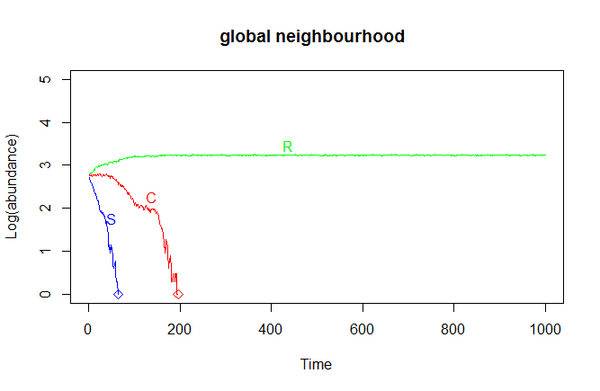
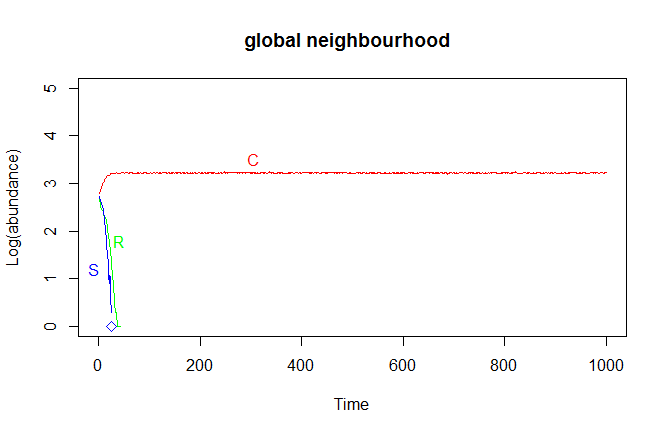
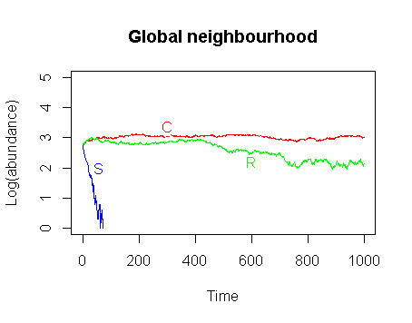

*** 

### Problem
The paper discusses a system involving a community of three competing species: colicinogenic E.coli (C), colicin-sensitive E.coli (S) and colicin-resistant E.coli (R). This C-S-R community satisfies a relationship similar to rock-paper-scissors game: S can displace R, R can displace C, and C can displace S. The main question the paper is discussing is the following: How does the relationship between the different strains affect the biodiversity in two ecological processes, i.e. (1) on a small spatial scale (called `local neighbourhood`)and (2) on a large spatial scale (called `global neighbourhood`). A code is written to simulate both ecological processes and the results of the code are discussed in this report.

### Assumptions
Several assumptions are made while writing the code:

 * a 50*50 lattice with periodic boundaries represents the community , 
 * R, C, S and E (empty state) are randomly assigned to the lattice points,
 * the points to be updated are randomly selected (and are called `focal points`) and it is assumed that all points in the lattice are updated after updating 50*50 focal points (which is called an `epoch`),
 * the local neighbourhood corresponds to the eight lattice points around the focal point (keeping in mind that there are periodic boundaries), 
 * the global neighbourhood corresponds to all lattice points around the focal point, and finally, 
 * updating a focal point depends on its current state and its neighbourhood state. The updating rules are the same for both small scale and large scale ecological processes and are shown in the following table.

State before update | State after update | Probability
----------- | ------------ | ----------- 
E | S | f_S
E | R | f_R
E | C | f_C
E | E | f_E
S | E | delta_S
S | S | 1-delta_S
R | E | delta_R
R | R | 1-delta_R
C | E | delta_C
C | C | 1-delta_C

In the table, f_S, f_R, f_C, and f_E are the fractions of S, R, C and E in the neighbourhood of the focal point. Delta_S, delta_R, and delta_C are the probability that the S, R, and C cells die or are killed. The former probability is dependend on the toxicity (represented by tau) of the colicin producing strain, i.e., delta_S = delta_S0 + tau*f_C. Delta_S0 is the probability that S dies without being influenced by the toxicity of C, and this value is assumed to be 1/4. The latter two probabilities are constant and are assumed to be 10/32 and 1/3, respectively. 

### Reproduction of line graphs and heatmap
A random lattice is updated corresponding to both ecological processes, and this section shows some graphs that keep track of all updates. For instance, a line graph representing the logaritm of the absolute abundances of all strains in the lattice is plotted in function of time (with one time unit corresponding to an epoch). The colicinogenic E.coli strain is denoted in red, the colicin-sensitive E.coli strain is denoted in blue, and the colicin-resistant E.coli strain is shown in green. A time-lapsed heatmap is additionally generated that shows, in the same color-coded manner, the location and the abundance of each strain in a lattice at each epoch. 

**Local Neighbourhood**  
The two images shown below illustrate the output of the code for local neighbourhood interactions. The linegraph shows that the abundances of each strain remain rather constant, but that the strains take turns outcompeting each other. At about 70 epochs, the chasing starts. The C strain dominates, but is quickly taken over by the R strain because of its higher growth-rate.  A while later, the S strain gains ground over the other strains and this is again caused by a higher growth-rate, but additionally because of the low abundance of the C strain. Then finally, the C strain starts killing the S strain with its toxicity and, once more, becomes dominating. This circular behavior is repeated for the rest of the graph and would theoretically go on forever.    
The same behavior can be seen on the time-lapsed heatmap, although it is subtle. When focusing on a single area, it can (in general) be seen that the C strain displaces the S strain, the S strain invades the R strain areas, and that the R strain takes over the C strain areas. However, the patches do not physically chase each other in an obvious manner, as the reader from the original paper would expect. 


**Global Neighbourhood**  
The two images shown below illustrate the output of the code for global neighbourhood interactions. This time, the abundances do not stay constant and the S strain dies rather fast caused by the continuous mixing of the 'toxic' C strain (points of death are shown with an asterix). The C strain is in its turn outcompeted by the R strain. In the end, only the resistant strain remains.


# need to be changed


```{r, echo=FALSE}

#Creation of grid
create_grid <- function(size){
  types <- c("E", "R", "C", "S")
  data <- sample(types, size*size, replace = T)
  grid <- matrix(data, size, size)
return(grid)
}

#Setting up local neighbourhood and calculating fractions
#Input = the location of the focal point (both the row and the column), the grid, and the size which corresponds to the amount of rows = of columns in this grid.
find_local <- function (focalpoint_row, focalpoint_column, grid, size){  
#If the focal point is situated on the edges, the local neighbourhood will have strange shape. Therefore, all edge cases are one by one implemented:
  # if first row: that row + next,
  # if last row: previous row + that row,
  # if inbetween: previous row + that row + next row,
  # if first column: that column + next,
  # if last column: previous column + that column,
  # if inbetween: previous column + that column + next column.
  
  grid[focalpoint_row, focalpoint_column]<- NA
    
#When the focal point is found somehwere in the middle,...
### Do this first because will happen the most: save computation time! ###
if(focalpoint_row != 1 && focalpoint_row != size){
    local <- grid[(focalpoint_row-1):(focalpoint_row+1),]
    if (focalpoint_column != 1 && focalpoint_column != size){
      local <- local[, (focalpoint_column-1):(focalpoint_column+1)]
    } else if (focalpoint_column == size){
      local <- local[, c(1, (focalpoint_column-1):(focalpoint_column))]
    } else{
      local <- local[, c((focalpoint_column):(focalpoint_column+1), size)]
    }
# When the focal point is found on the first row, ...
} else if (focalpoint_row == 1){
    local <- grid[c((focalpoint_row):(focalpoint_row+1),size), ]
    if (focalpoint_column != 1 && focalpoint_column != size){
      local <- local[, (focalpoint_column-1):(focalpoint_column+1)]
    } else if (focalpoint_column == size){
      local <- local[, c(1, (focalpoint_column-1):(focalpoint_column))]
    } else{
      local <- local[, c((focalpoint_column):(focalpoint_column+1), size)]
    }
#When the focal point is found on the last row, ...
} else{
    local <- grid[c(1, (focalpoint_row-1):(focalpoint_row)),]
    if (focalpoint_column != 1 && focalpoint_column != size){
      local <- local[, (focalpoint_column-1):(focalpoint_column+1)]
    } else if (focalpoint_column == size){
      local <- local[, c(1, (focalpoint_column-1):(focalpoint_column))]
    } else{
      local <- local[, c((focalpoint_column):(focalpoint_column+1), size)]
    }
}
  
  f_e <- length(grep("E", local))/8
  f_r <- length(grep("R", local))/8
  f_c <- length(grep("C", local))/8
  f_s <- length(grep("S", local))/8
  R_ab <- length(grep("R", grid))
  C_ab <- length(grep("C", grid))
  S_ab <- length(grep("S", grid))
  
  info <- list(f_e, f_r, f_c, f_s, R_ab, C_ab, S_ab)
  return(info)
}

find_global <- function (focalpoint_row, focalpoint_column, grid, size){
  #the global neighbourhood consists of all entries in the grid except for the given one. We can therefore simply remove the given one from the grid and then calculate the abundances. 
  grid[focalpoint_row, focalpoint_column] <- NA
  #Could replace with 1-f_r-f_c-f_s to save computation time
  f_e <- length(grep("E", grid))/(size*size-1)
  f_r <- length(grep("R", grid))/(size*size-1)
  f_c <- length(grep("C", grid))/(size*size-1)
  f_s <- length(grep("S", grid))/(size*size-1)
  R_ab <- length(grep("R", grid))
  C_ab <- length(grep("C", grid))
  S_ab <- length(grep("S", grid))
  
  info <- list(f_e, f_r, f_c, f_s, R_ab, C_ab, S_ab)
  return(info)
}

#Setting up parameters. Should be converted into a function in the end, with the actual values as input. 
delta_r <- 10/32
delta_c <- 1/3
delta_s0 <- 1/4
tau <- 3/4

replace_focal <- function(focalpoint, neighbourhood_info){
  #What is the value of the focal point? 
  if (focalpoint == "E"){
    #Update empty space based on the occurence of the different types in the neighbourhood.
    focalpoint <- sample(c("E", "R", "C", "S"), 1, replace = T, prob = c(neighbourhood_info[[1]], neighbourhood_info[[2]], neighbourhood_info[[3]], neighbourhood_info[[4]]))
  #Kill microorganism, with a probability equal to the given delta's. 
  } else if (focalpoint == "R"){
    focalpoint <- sample(c("E", "R"), 1, replace = T, prob = c(delta_r, (1-delta_r)))
  } else if (focalpoint == "C"){
    focalpoint <- sample(c("E", "C"), 1, replace = T, prob = c(delta_c, (1-delta_c)))
  } else {
    delta_s <- delta_s0 + tau*neighbourhood_info[[3]]
    focalpoint <- sample(c("E", "S"), 1, replace = T, prob = c(delta_s, (1-delta_s)))}
    
    return(focalpoint)
}

#Updating the grid. This happens randomly and 62500 updates are called an 'epoch'.
#Inputs: the type of interaction (either "local" or "global"), the grid you want to update, the size of this grid, the amount of updates you want to occur, and 'stop_heatmap' = the amount of epochs you want to see the time-lapsed heatmap of
update_grid <- function(interaction, grid, size, updates, epochs_heatmap){
  #dev.cur()
  #Initializing
  epoch <- size*size
  counter <- 0
  epochcounter <- 0
  R_abundance <- 0
  C_abundance <- 0
  S_abundance <- 0
  
  #Updating the grid using two approachinges: local interactions, or global interactions. 
  for (i in 1:(epoch*updates)){
    counter <- counter + 1
  #Randomly select a location and obtain its value in both grids: the one made with local interactions, and the one made with global interactions. 
  focalpoint_row = sample(1:nrow(grid), 1)
  focalpoint_column = sample(1:ncol(grid), 1)
  focalpoint <- grid[focalpoint_row, focalpoint_column]
  
  if (interaction == "local"){
    #Call upon find_local to find the probabilities.
    info <- find_local(focalpoint_row, focalpoint_column, grid, size)
    #Replace the focal points according to their neighbourhoods (call upon replace_focal).
    grid[focalpoint_row, focalpoint_column] <- replace_focal(focalpoint, info)
    } else{    
    #Call upon find_global to find the probabilities for both grids. 
    info <- find_global(focalpoint_row, focalpoint_column, grid, size)
    #Replace the focal points in both grids according to their neighbourhoods (call upon replace_focal).
    grid[focalpoint_row, focalpoint_column] <- replace_focal(focalpoint, info)
    }     

  #For each epoch, save the abundance information to generate the plots later on. This abundance information is already present in both info_local and info_global, so we only have to save this information in new vectors.
  if (counter == epoch) {
    epochcounter <- epochcounter + 1
    counter <- 0
    #To follow progress:     
    print(epochcounter)
    
    R_abundance[epochcounter] <- info[[5]]
    C_abundance[epochcounter] <- info[[6]]
    S_abundance[epochcounter] <- info[[7]]
  
    if(epochcounter <= epochs_heatmap && epochs_heatmap != 0){
    dev.new() #This gives a warning, but solves an important problem:Somehow, if we don't set a new device, information is wrongly being transferred and C always wins while R dies off first.
    #Create the heatmap for this grid
    #Convert the letters to numbers: "E" = 1, "R" = 2, "C" = "3", "S"= 4. When one of these dies out, we get problems!!
    first <- gsub("E", 1, grid)
    second <- gsub("R", 2, first)
    third <- gsub("C", 3, second)
    fourth <- gsub("S", 4, third)
    vector_numbers <- as.numeric(fourth)
    matrix_numbers <- matrix(vector_numbers, nrow = size, ncol = size, byrow = FALSE)
    colors <- c("white", "green", "red", "blue")
    alive_S <- grep("4", matrix_numbers)
    alive_C <- grep("3", matrix_numbers)
    if(length(alive_S) == 0){colors <- c("white", "green", "red")}
    if(length(alive_C) == 0){colors <- c("white", "green")}
    
      #To ascertain that the gif is shown in the correct order (example%002d.png was not completely working, so I'm doing it manually)
      if(epochcounter <10){
      png(file=paste("000", epochcounter, "heatmap.png", sep = ""), width=1000, height=1000)
      plot <- heatmap(matrix_numbers, Rowv = NA, Colv = NA, col = colors, labRow = NA, labCol = NA)
      dev.off() #if not here: images are empty
      } else if(epochcounter >= 10 && epochcounter<100 ){
      png(file=paste("00", epochcounter, "heatmap.png", sep = ""), width=1000, height=1000)
      plot <- heatmap(matrix_numbers, Rowv = NA, Colv = NA, col = colors, labRow = NA, labCol = NA)
      dev.off()
      } else if(epochcounter >= 100 && epochcounter<1000 ){
      png(file=paste("0", epochcounter, "heatmap.png", sep = ""), width=1000, height=1000)
      plot <- heatmap(matrix_numbers, Rowv = NA, Colv = NA, col = colors, labRow = NA, labCol = NA)
      dev.off()
      } else {
      png(file=paste(epochcounter, "heatmap.png", sep = ""), width=1000, height=1000)
      plot <- heatmap(matrix_numbers, Rowv = NA, Colv = NA, col = colors, labRow = NA, labCol = NA)
      dev.off()
      }
    #rm(heatmap)
    rm(plot)
    }#if loop: printing heatmaps
  }#if loop: save abundances + print heatmaps for each epoch
  }#the ONE for loop
  
  if(epochs_heatmap != 0){
  png(file=paste(epochcounter+1, "heatmap.png", sep = ""), width=1000, height=1000)
  plot.new()
  plot <- text(.5, .5, paste("You just saw", epochs_heatmap, "heatmaps!", sep = " "), cex = 6)
  dev.off()
  
  shell("convert -delay 20 *.png example_1.gif")
  file.remove(list.files(pattern=".png"))
  }
  
  output_update <- list(grid, R_abundance, C_abundance, S_abundance)
  return(output_update)
}

#Now we need to plot the abundances of the local neighbourhoods. Be certain to also input the amount of updates that were performed. 
plot_abundance <- function(output_update, updates, neighbourhood){
  x <- c(1:updates)
  
  #plot the abundance of R
  plot <- plot(x, log10(output_update[[2]]), ylim = c(0,5), type = "l", col = "green", xlab="Time",ylab="Log(abundance)",main=paste(neighbourhood, "neighbourhood", " "))
  #plot the letter "R"
  # points(300, 3.1, pch = "R", cex = 1, col = "green")
  # or here you can write as:
   points(locator(),pch = "R", cex = 1, col = "green")
  
  #plot the abundance of C
  points(x, log10(output_update[[3]]), type = "l", col = "red")
  #plot an asterix where C dies
  vector <- output_update[[3]]
  logical <- vector == 0
  dead <- grep(TRUE, logical)
  points(dead[1], 0, pch= 5, cex = 1, col = "red")
  #plot the letter "C"
  #points(170, 3, pch = "C", cex = 1, col = "red")
  # or here you can write as:
   points(locator(),pch = "C", cex = 1, col = "red")
  
  #plot the abundance of S
  points(x, log10(output_update[[4]]), type = "l", col = "blue")
  #plot an asterix where S dies
    vector <- output_update[[4]]
    logical <- vector == 0
    dead <- grep(TRUE, logical)
    points(dead[1], 0, pch= 5, cex = 1, col = "blue")
  #plot the letter "S"
  #points(50, 2.4, pch = "S", cex = 1, col = "blue")
  # or here you can write as:
   points(locator(),pch = "S", cex = 1, col = "blue")
  
  
  #empty is not plotted
#   return(localplot)
}

```

### Experiment
**Hypothesis**    
The same community as before is experimented with, while all parameters and assumptions remain the same expect for the probabilites. I.e., the probability of the R cells to die or be killed is changed to 1/2 first and then to 1/3. Both  new probabilities are bigger than before and as such, R will be displaced by the empty state more easily. In other words this means that for a well-mixed system (based on the global neighbourhood interactions), the R cells no longer have the growth-rate advantage over the C cells. The general expectation is that the chance of the C cells surviving under these conditions is bigger, however, this will depend on the exact value of *all* the probabilites. More specifically, when the probability is changed to 1/2, the expectation is that the C cells survive. The C strain is not toxic to R and the only competition  between C and R thus depends on their separate growth-rates. When the R-probability of death is changed to 1/3, in contrast, the difference between the R-probability and the C-probability of death are equal and as such it is expected that both C and R strains will survive, i.e., none is able to outcompete the other. Since nothing is changed to the S-probability of death and since C is still toxic to it, the S strain is expected to die in both situations.
  
**Results and Discussion**        
Below, two images are shown that illustrate the abundances of each strain as a function of time, while the probabilities are experimented with. It can be seen that all expectations are met: when the C-probability of death is smaller than the R-probability of death, the C strain will outcompete the R strain when applying global neighbourhood interactions. When delta_C is the same as delta_R, R and C can coexist in the system. When delta_C is larger than delta_R, only R will survive after 1000 epochs. The S strain will be killed by the toxic collicin produced by the C strain. Since both the growth-rate of the C strain and the S-probability of death do not change, the performance of S remains rather invariable during these experiments.

When delta_R is changed to 1/2, which is greater than delta_C, the result is:



When delta_R is changed to 1/3, which is the same as delta_C, the result is:



